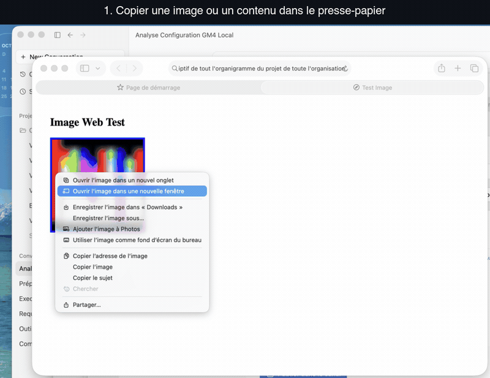

# Guide utilisateur — PasteAsFile

PasteAsFile est une extension pour le Finder de macOS. Elle ajoute une commande « Coller à partir du presse-papier » dans le menu contextuel, permettant de transformer instantanément le contenu du presse-papier en fichier dans le dossier courant.



## 1. Fonctionnement général

Dans le Finder, un clic droit dans un dossier suivi d'un clic sur « Coller à partir du presse-papier » déclenche l'inspection du presse-papier système :

1. **Fichiers déjà copiés** : si le presse-papier contient des références de fichiers (ex. fichiers copiés depuis une autre fenêtre du Finder), PasteAsFile les duplique dans le dossier de destination en préservant leurs noms d'origine. En cas de collision, un suffixe numérique (` 1`, ` 2`) est ajouté automatiquement.
2. **Données brutes en mémoire** : si le presse-papier contient une image, un document ou du texte copié depuis une application (navigateur web, tableur, éditeur de code, capture d'écran), PasteAsFile extrait les octets exacts sans réencodage ni perte, et génère un fichier horodaté :
   ```text
   Collé AAAA-MM-JJ à HH.MM.SS.ext
   ```
3. **Absence de format reconnu** : si le presse-papier est vide ou contient un type non pris en charge, aucune opération n'est exécutée et aucun fichier n'est créé. L'application ne génère jamais de fichiers parasites comme `.textClipping`.

## 2. Formats pris en charge et ordre de priorité

L'extension inspecte les Uniform Type Identifiers (UTI) déclarés par le presse-papier selon un ordre de priorité déterministe. Dès que le premier type correspondant est détecté, le fichier est écrit avec l'extension associée :

| Priorité | UTI inspecté | Extension produite | Exemple de source |
| :--- | :--- | :--- | :--- |
| 1 | `public.tiff` | `.tiff` | Safari (« Copier l'image »), Aperçu, captures système |
| 2 | `public.png` | `.png` | Navigateurs web, outils de retouche, Chrome/Firefox |
| 3 | `public.jpeg` | `.jpeg` | Navigateurs web, visionneuses photo |
| 4 | `com.apple.icns` | `.icns` | Icônes d'applications macOS |
| 5 | `com.adobe.pdf` | `.pdf` | Aperçu, Illustrator, Acrobat |
| 6 | `public.svg-image` | `.svg` | Figma, Illustrator, éditeurs vectoriels |
| 7 | `public.rtf` | `.rtf` | TextEdit, Word, Pages (texte mis en forme) |
| 8 | `public.html` | `.html` | Fragments web avec structure DOM |
| 9 | `public.plain-text` | `.txt` | Terminal, éditeurs de code, blocs-notes |

Le texte mis en forme (`public.rtf`) est prioritaire sur le texte brut (`public.plain-text`). Ainsi, une sélection issue de TextEdit ou Pages conserve son formatage et son style d'origine dans un document `.rtf`.

## 3. Guide pas-à-pas

### Coller une image issue du web
1. Dans Safari, faites un clic droit sur une image puis sélectionnez **Copier l'image**.
2. Dans le Finder, ouvrez le dossier où enregistrer le fichier (par exemple votre dossier Documents ou Téléchargements).
3. Faites un clic droit dans une zone vide de la fenêtre et cliquez sur **Coller à partir du presse-papier**.
4. Le fichier `Collé <date> à <heure>.tiff` apparaît immédiatement. Appuyez sur la barre d'espace pour afficher le coup d'œil et vérifier l'intégrité de l'image.

### Coller du texte enrichi ou du code
1. Copiez un extrait de texte dans votre éditeur ou navigateur.
2. Rendez-vous dans le dossier cible dans le Finder.
3. Clic droit dans le vide → **Coller à partir du presse-papier**.
4. Le fichier `.rtf` ou `.txt` correspondant est créé sans ouvrir d'éditeur intermédiaire.

### Gestion des doublons
Si vous collez plusieurs fois d'affilée dans la même seconde ou si un fichier de même nom existe déjà, PasteAsFile ajoute automatiquement un indice sans jamais écraser vos données :
- `Collé 2026-10-01 à 17.44.37.tiff`
- `Collé 2026-10-01 à 17.44.37 1.tiff`
- `Collé 2026-10-01 à 17.44.37 2.tiff`

## 4. Architecture et respect de la vie privée

PasteAsFile applique une stricte politique de confidentialité et de sécurité :

- **100 % local** : aucun serveur distant, aucune télémétrie, aucune communication réseau. L'application ne contient aucune dépendance tierce et n'effectue aucun appel sortant.
- **Aucune authentification requise** : l'application n'utilise pas de compte utilisateur, pas de clé API, pas de jeton d'accès (access token ou refresh token), ni de protocole OAuth. Les opérations s'exécutent entièrement en mémoire vive et sur le stockage local.
- **Confinement Sandbox Apple** : l'extension s'exécute dans un conteneur sandboxé géré par le démon système `pkd` (`com.apple.FinderSync`). Elle accède exclusivement au presse-papier système (`NSPasteboard`) et aux répertoires du dossier personnel autorisés.
- **Intégrité binaire** : les octets stockés dans le presse-papier sont écrits sur le disque à l'identique (hachage SHA-256 rigoureusement identique entre le buffer source et le fichier final).

## 5. Dépannage et réactivation

### L'entrée de menu n'apparaît pas dans le Finder
1. Vérifiez que l'extension est activée dans macOS :
   - Ouvrez **Réglages Système** → **Général** → **Ouverture et extensions** → **Extensions Finder**.
   - Assurez-vous que la case **PasteAsFileFinder** est bien cochée.
2. Si le Finder ne rafraîchit pas le menu, relancez-le :
   ```bash
   killall Finder
   ```
3. Vérifiez l'état d'enregistrement via le terminal :
   ```bash
   pluginkit -m -A -D -p com.apple.FinderSync | grep -i pasteasfile
   ```
   La ligne doit afficher `+` en première colonne, indiquant une extension enregistrée et active.

### En cas de doublons après recompilation
Si plusieurs entrées apparaissent dans les réglages système après des manipulations dans Xcode, purgez les index de cache :
```bash
scripts/activate-extension.sh
```
Ce script nettoie les références orphelines, réenregistre l'appex certifié situé dans `/Applications` et redémarre le Finder.
